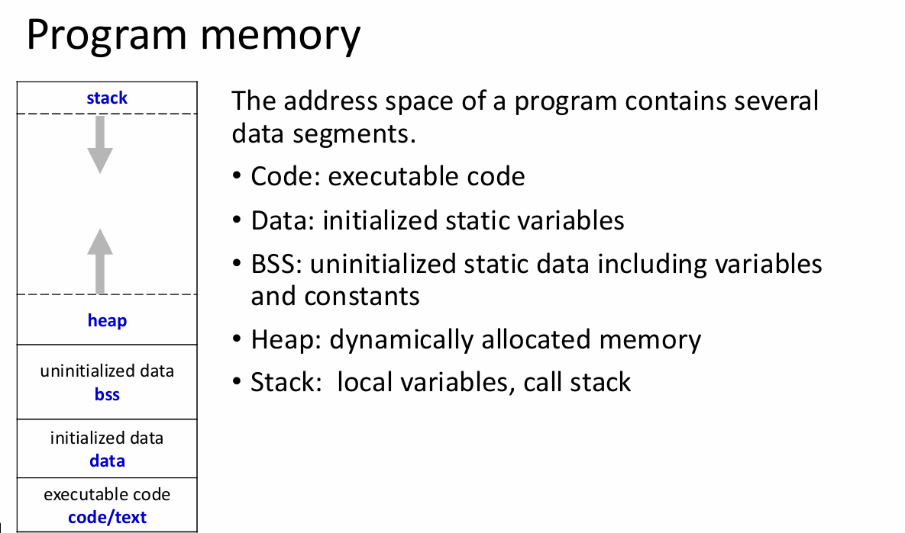
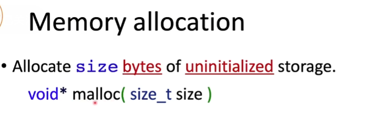
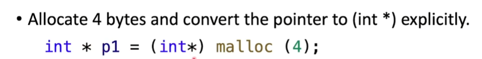
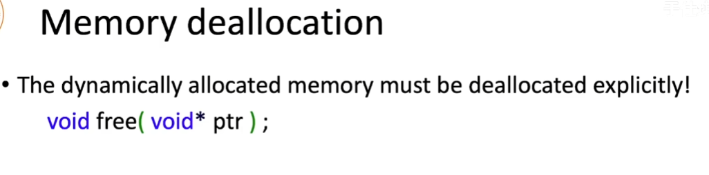
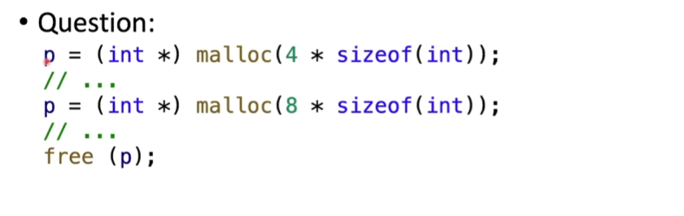
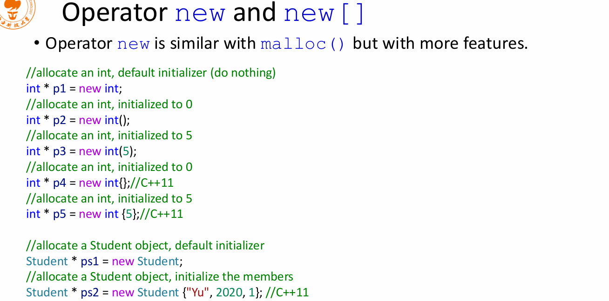
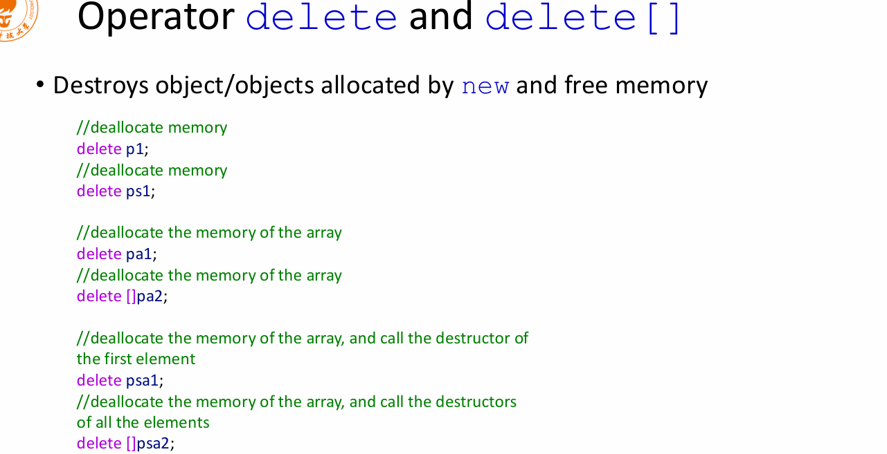

# Pointer

### 1. The difference between array and pointer

数组名是一个常量地址，代表数组首元素的地址
数组名不是变量，不能被赋值（不能改指向）
除了两种特殊情况，数组名都等价于指向首元素的指针

```C++
sizeof(class3) // 数组总字节数
sizeof(p) // 指针大小一般 4 or 8
```

### 2. const int int const and const int *p and int *const p

const int 和 int const 是一样的. 一般写成 const int, 以保持一致性

const int *p → const 离 int 近 → 锁内容

``` C++
const int *p;
p = &x;   // 可以
*p = 10;  // 错误！
```

int *const p → const 离 p 近 → 锁指针

```C++
int *const p;
p = &x;   // 错误！
*p = 10;  // 可以
```

### Program memory

bss: 存放 “全局 / 静态变量，但没给初始值” 的区域。

```C++
int a;          // 全局，未初始化 → BSS
static int b;   // 静态，未初始化 → BSS

int c = 10;     // 已初始化 → data 段
```

data: 存放 “全局 / 静态变量，且给了初始值” 的区域。
stack: 存放函数的局部变量和参数。
heap: 由程序员分配和释放的内存区域。



可以看出stack越用越往上 （地址越小），heap越用越往下（地址越大）。如果stack和heap相遇了，就会发生stack overflow.

### Allocate memory

#### C Style



size_t 是无符号整数类型，通常是 unsigned int 或 unsigned long，具体取决于平台和编译器。
为什么是size_t 代表内存大小？

因为它的最大值，刚好能覆盖你平台上所有可能的内存大小。
32 位系统：size_t 最大能表示 2^32 - 1（约 4GB），正好是地址空间的上限
64 位系统：size_t 最大能表示 2^64 - 1（理论上），足够覆盖整个 64 位地址空间



需要convert一下类型 需要什么类型就什么类型转换过来。

不存在类似于Python和Java的垃圾回收机制，所以需要手动释放内存，否则会发生内存泄漏。

看下面一个问题


p在删除前指向了另一块地址，free掉,第一次申请的内存我们就无法找到了

```C++
void foo(){
    int *p = (int *)malloc(sizeof(int)); // 在堆上分配一个 int 大小的内存，返回指向它的指针
    return
}
// memory leak: foo() 结束后，p 的作用域结束了，但它指向的内存没有被释放，导致内存泄漏。

```

一定记得有申请有释放

#### C++ Style



```C++
int *p = new int; // 在堆上分配一个 int 大小的内存，返回指向它的指针
*p = 10; // 使用这个内存
delete p; // 释放这个内存
```


psa1是类或者结构体的对象数组，delete psa1 调用第一个元素的析构函数来释放资源.

delete []psa2 是用来释放数组的内存，delete []psa2 会调用数组中每个元素的析构函数来释放资源。
delete 只能释放 new 分配的内存，不能释放 malloc 分配的内存，否则会导致未定义行为。同样，free 只能释放 malloc 分配的内存，不能释放 new 分配的内存，否则也会导致未定义行为。